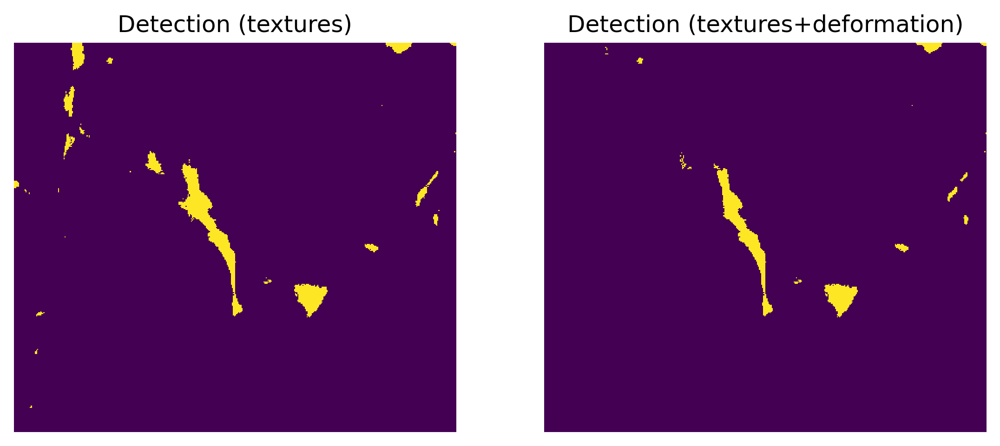

# MOIRA

The package functionality includes deformation state detection from SAR Sentinel-1 GRD Level-1 images based on
combined use of texture characteristics and ice deformation data.
The use of ice deformation data is optional but efficiently complement SAR textures 
for unambiguous distinguishing between ridged and level ice.

The package also includes tools to prepare the input data for the training and detection. 

The test trained models for Sentinel-1 EW and IW data are also included in the package.

The following Quickstart guide covers ridged ice detection example step-by-step.

## Quick start

For quick start tutorial you can download a test Sentinel-1 image:

https://drive.google.com/file/d/164js5XFyExW5tt9Ud7PgvOG5upKshK_U/view?usp=sharing

and a file with ice deformation for the same date as for the SAR image acquisition:

https://drive.google.com/file/d/1gnKJ-kIhsUyIpHtnhnFrn47AHFd0lPfX/view?usp=sharing

The image provided by European Space Agency (ESA) © and has been downloaded from 
Copernicus Open Access Hub (https://scihub.copernicus.eu/)

To start using the package you need to change working directory or just copy ```ridge_classification.py``` 
into your local directory.

```python
import matplotlib.pyplot as plt
import os
plt.rcParams['figure.dpi'] = 150
from ridge_classification import *

# 1. First, we calculate multiscale texture features from Sentinel-1 image

s1_file = 'S1B_IW_GRDH_1SDV_20201222T203955_20201222T204024_024820_02F3F4_625F.zip'

# Define lat/lon bounding box
lon1, lat1 = 149.7342, 75.3338
lon2, lat2 = 153.0878, 75.4001

# Define projection EPSG number and pixel size in meter
proj_epsg = 5940
res = 20

# Initialize SAR texture object
t = SarTextures(s1_file, bbox=[lon1, lat1, lon2, lat2])
# Calibrate and project data
t.calibrate_project(proj_epsg, res, mask=False, write_file=True, out_path=out_path, backscatter_coeff='sigmaNought')
# Calculate texture features
t.calcTexFt()
# Save texture features in netCDF4 format
t.export_netcdf('textures_%s.nc' % 
                (os.path.basename(t.name).split('.')[0]))

# 2. Initialize a detection object based on only SAR textures and on SAR textures + ice defromation
clf_textures = deformedIceClassifier()
clf_textures_defo = deformedIceClassifier()

# 3. Load the detection models
# Load the detection model (from textures) for Sentinel-1 IW VV data 
clf_textures.load_model('models/mod_text_IW_VV.sav')

# Load the detection model (from textures + deformation) for Sentinel-1 IW VV data 
clf_textures_defo.load_model('models/mod_text_defo_IW_VV.sav')

# 4. Open file with texture features created at Step 1
f_textures = 'textures_norm_s0_vv_S1B_IW_GRDH_1SDV_20201222T203955_20201222T204024_024820_02F3F4_625F_out.nc'
fts = clf_textures.read_features_file(f_textures)

# 5. Perform detection from texture fetutures
res_text = clf_textures.detect_ice_state(fts)

# 6. Then we want to perform the detection using SAR textures + ice deformation data

# Open texture features and deformation data
f_defo = '100px_ICEDEF_20201221t204819_20201222t203955.nc'
fts_defo = clf_textures.read_features_file(f_textures, f_defo)

# Mask deformation data (the last two features) over areas classified as level ice
fts_defo[:,:,-1][res_text<2] = 0
fts_defo[:,:,-2][res_text<2] = 0

# Perform the detection
res_text_defo = clf_textures_defo.detect_ice_state(fts_defo)

# 7. Plot and compare results
# Bbox for visualization
r1, r2, c1, c2  = 830, 1200, 1480, 1900

fig, ax = plt.subplots(1, 2, sharex=True, sharey=True, figsize=(9, 4))

ax[0].imshow(res_text[r1:r2, c1:c2], interpolation='nearest')
ax[0].set_title('Detection (textures)')
ax[1].imshow(res_text_defo[r1:r2, c1:c2], interpolation='nearest')
ax[1].set_title('Detection (textures+deformation)')
ax[0].axis('off')
ax[1].axis('off')
```



Below you will find how prepare and calculate your data for the processing.

## 1. Open Sentinel-1 image

First you should import all classes from the package

```python
from ridge_classification import *
```

Then a Sentinel-1 image can be initialized by `SarTextures` class

```python
t = SarTextures(PATH/TO/S1/FILE)
```

where `PATH/TO/S1/FILE` is a path to Sentinel-1 GRD (EW/IW) Level-1 file; 
You also can specify:
`ws` - windows size for texture features computation; 
`stp` - computational grid step size; 
`threads` - number of threads.

## 2. Calibrate and project Sentinel-1 image

Peform data calibration and projection onto Polar Stereographic projection (EPSG:5041) with a spatial resolution of 50 [meters].

```python
t.calibrate_project(5940, 50, mask=False, write_file=False, out_path='/OUTPUT/DIRECTORY')	
```

other parameters includes: `write_file` - set to True if you want to export the calibrated data as a geotiff file; `out_path` - ouput directory to store a geotiff file. 

## 3. Vector data preparation

The classification require reference data for the training. The common way to produce that is manual mapping of ridged and flat ice using GIS software. Once it is done, a vector file should be initialized by a class for vector data processing called `VectorData`:

```python

v = VectorData('/PATH/TO/VECTOR/FILE', t.ds[list(t.ds.keys())[0]], downsample=True)

```

where `t.ds[list(t.ds.keys())[0]]` is a gdal object with a projected geotiff from a previous step and we also set a `downsample` parameter to True to make further computations more fast. 

Or you can specify a path to GeoTIFF file as the second parameter:

```python

v = VectorData('/PATH/TO/VECTOR/FILE', '/PATH/TO/GEOTIFF/FILE', downsample=True)

```

We recommend to keep `downsample` parameter equal `True` for the computational efficiency and consistency.
Now we rasterize it to the output file.

```python
v.rasterize('PATH/TO/RASTERIZED/GEOTIFF/TIFE')

```

## 4. SAR textures calculation

calculate texture characteristics and edges from SAR data:

```python
t.calcTexFt()
```

Then the obtained result can be stored in NetCDF4 file:

```python
t.export_netcdf('PATH/TO/OUTPUT/NETCDF')
```