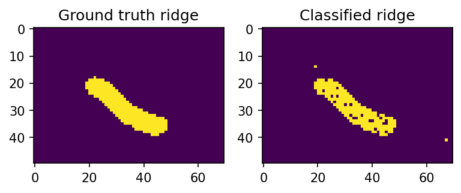

# MOIRA

The package allows to perform classification of ridged and flat ice from SAR Sentinel-1 GRD Level-1 image based on texture characteristics and ice deformation data.
There are two ways of classification - using ice deformation data along with SAR textures and using only SAR texture information. We reccomend to use the both data sources as a more robust way to overcome obstacles caused by the similar signature of ridged ice and young ice in leads but the deformation data is optional for the algorithm.

The package also includes some tools that helps to prepare the data for classification. 

The following Quickstart guide covers all the essentials steps to perform sea ice ridge classification in step by step manner.

## 1. Open Sentinel-1 image

First you should import all classes from the package

```python
	from ridge_classification import *
```

Then a Sentinel-1 image can be initialized by `SarTextures` class

```python
	t = SarTextures(PATH/TO/S1/FILE, ws=11, stp=15, threads=10)
```

where `PATH/TO/S1/FILE` is a path to Sentinel-1 GRD (EW/IW) Level-1 file; `ws` - windows size for texture features computation; `stp` - computational grid step size; `threads` - number of threads.

## 2. Calibrate and project Sentinel-1 image

Peform data calibration and projection onto Polar Stereographic projection (EPSG:5041) with a spatial resolution of `res` [meters].

```python
	t.calibrate_project(5041, res, mask=False, write_file=False, out_path='/OUTPUT/DIRECTORY')	
```

other parameters includes: `write_file` - set to True if you want to export the calibrated data as a geotiff file; `out_path` - ouput directory to store a geotiff file. 

## 3. Vector data preparation

The classification require reference data for the training. The common way to produce that is manual mapping of ridged and flat ice using GIS software. Once it is done, a vector file should be initialized by a class for vector data processing called `VectorData`:

```python

	v = VectorData('/PATH/TO/VECTOR/FILE', t.ds[list(t.ds.keys())[0]], downsample=True)
```

where `t.ds[list(t.ds.keys())[0]]` is a gdal object with a projected geotiff from a previous step and we also set a `downsample` parameter to True to make further computations more fast. 


```python
	v.rasterize('PATH/TO/RASTERIZED/GEOTIFF/TIFE')

```

## 4. SAR texture calculation

To calculate SAR texture characteristics which are GLCM features a method called `calcTexFt()` from `SarTextures` is used:

```python
	t.calcTexFt()
```

Then the obtaned results can be stored in NetCDF4 file:

```python
	t.export_netcdf('PATH/TO/OUTPUT/NETCDF')
```

## 5. Ridged ice detection

To classify ice into two classes: ridged/non-ridged sea ice a class first you need to train a classifier. To do that data for trainig should be prepared and passed into class `ridgedIceClassifier`

```python
	clf = ridgedIceClassifier(glcm_filelist, ridges_filelist, flat_filelist, defo_filelist, defo_training=False)
```

where `glcm_filelist` - file list containing SAR texture features calculated during the Step 4; `ridges_filelist` - file list containing rasterized ridges in geotiff format; `flat_filelist` - file list containing rasterized flat ice regions in geotiff format; `defo_filelist` (optional) - file list containing ice deformation data; `defo_training` - should be set to True if you want to use ice deformation data for training.

when data initialized the train data will be stored as Pandas data frame in `train_data` atribute:

```python
	clf.train_data
```

To train Random-Forests classifier you should pass texture feature name list into `train_rf_classifier` method. In our case we pass all of them using `glcm_names` list:

```python
	clf.train_rf_classifier(clf.glcm_names)
```

To classify data based on SAR texture characteristics (see Step 4) and ice deformation data (optional) use:

```python
	result = clf.classify_data('PATH/TO/SAR/TEXTURES/FILE', 'PATH/TO/ICE/DEFORMATION/FILE' (optional), [r_min, r_max, c_min, c_max] (optional))
```

where `[r_min, r_max, c_min, c_max]` is bounding box in pixel coordinates

## Quick start

```python
import matplotlib.pyplot as plt
plt.rcParams['figure.dpi'] = 150
from ridge_classification import *

glcm_filelist = glob.glob('test_classification/glcm_features/*.nc')
flat_filelist = glob.glob('test_classification/flat_rasters/*.tiff')
ridges_filelist = glob.glob('test_classification/ridge_rasters/*.tiff')
defo_filelist = []

test_clf = ridgedIceClassifier(glcm_filelist, ridges_filelist, flat_filelist, defo_filelist, defo_training=False)

# Training
test_clf.train_rf_classifier(test_clf.glcm_names)

# Bounding box
bbox = [150,200,400,470]

# Classification
test_clf.classify_data('/mnt/sverdrup-2/sat_auxdata/MOIRA/data/test_classification/glcm_features/norm_s0_vh_S1B_IW_GRDH_1SDV_20201222T203955_20201222T204024_024820_02F3F4_625F_out.nc', None, bbox)

# Resample ground truth ridge data
r = Resampler('test_classification/ridge_rasters/20201222T203955_hummock_new.tiff','test_classification/glcm_features/norm_s0_vh_S1B_IW_GRDH_1SDV_20201222T203955_20201222T204024_024820_02F3F4_625F_out.nc')
rr = r.resample(r.f_source['lons'], r.f_source['lats'], r.f_target['lons'], r.f_target['lats'], r.f_source['data']['s0'])

# Binarize ground truth data
rr[rr>0]=1

f, axarr = plt.subplots(1,2)
axarr[0].imshow(rr[bbox[0]:bbox[1],bbox[2]:bbox[3]], interpolation='nearest')
axarr[0].set_title('Ground truth ridge')

axarr[1].imshow(test_clf.classified_data[bbox[0]:bbox[1],bbox[2]:bbox[3]], interpolation='nearest') #, cmap='gray')
axarr[1].set_title('Classified ridge')
```




